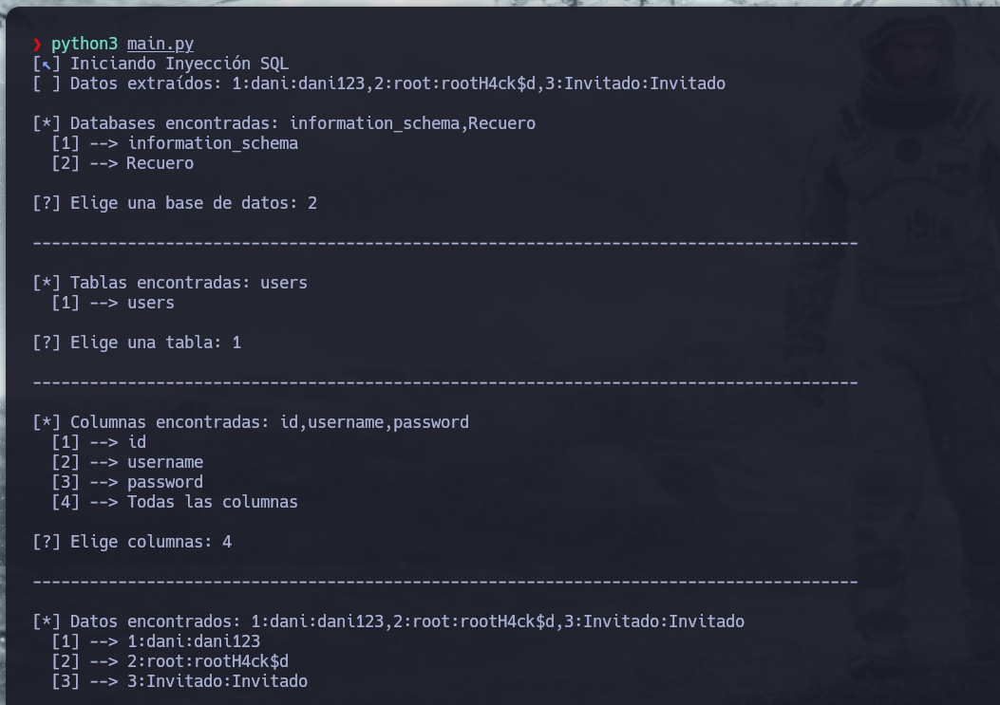

# 💻 Aportación Hack4u: SQL Injection con Python y PHP
***
## 🧮 INTRODUCCIÓN:
Este repositorio es una aportación a la clase de `SQL Injection` de la academia `Hack4u` de `S4vitar`, en la que se contemplan distintos tipos de inyecciones SQL a través de un script `.php` que conecta con una base de datos. Sin embargo, a la hora de mostrar los errores u ocultarlos, he encontrado algunos problemas, y por ello he modificado los archivos `.php` para poder seguir la clase sin complicaciones.

Además, también aporto los scripts en Python usados para las SQLI a ciegas, que he retocado para que se automatice la inyección y se enumeren, las bases de datos, sus respectivas tablas, columnas y datos.
***
### 📁 SCRIPTS PHP:
>Estos script PHP establecen una conexión con una base de datos y realizan una consulta SQL utilizando un valor recibido por la URL a través del parámetro `id`. Usa `mysqli` para ejecutar la consulta y muestra el resultado en pantalla, extrayendo un campo específico de la tabla. Sin embargo, construye la consulta insertando directamente el valor del parámetro sin validación, lo que lo hace vulnerable a ataques de inyección SQL.

***
#### ❌ ERROR BASED SQLI:

``` php
mysqli_report(MYSQLI_REPORT_ERROR | MYSQLI_REPORT_STRICT);
```
**Activa el modo estricto de errores para MySQLi**. Esto significa que:
- `MYSQLI_REPORT_ERROR`: hace que se muestren los errores de MySQLi automáticamente.
- `MYSQLI_REPORT_STRICT`: hace que esos errores se lancen como **excepciones (`mysqli_sql_exception`)** en lugar de solo mostrar un warning.
***
``` php
try {
    $data = mysqli_query($conn, "SELECT username FROM users WHERE id = '$id'");
    $response = mysqli_fetch_array($data);
    echo $response['username'];
} catch (Exception $e) {
    echo "Error SQL: " . $e->getMessage();
}
```
Si la consulta se ejecuta correctamente, muestra el nombre de usuario en pantalla. Si ocurre un error (por ejemplo, un fallo de conexión o un error de sintaxis SQL), se lanza una excepción (gracias a `mysqli_report(...)`) y el bloque `catch` captura ese error, mostrando un mensaje personalizado con la descripción del problema.
***
#### 🔍 SI NO SE MUESTRAN ERRORES:
``` php
mysqli_report(MYSQLI_REPORT_OFF);
```
Desactiva todos los reportes de errores de MySQLi, es decir, **evita que se muestren mensajes de error o advertencias relacionadas con operaciones de MySQL**. Así, si ocurre un error en una consulta o conexión, el script no mostrará ninguna notificación ni excepción, permitiendo que la página siga funcionando sin interrumpirse ni mostrar detalles de errores al usuario.
***
### 🐍 SCRIPTS EN PYTHON:
>Estos scripts son herramientas automáticas para explotar vulnerabilidades de inyección SQL en aplicaciones web que no muestran errores explícitos. Funcionan extrayendo información de la base de datos carácter por carácter, primero listando bases de datos, luego tablas, columnas y finalmente los datos de interés, mediante consultas especialmente diseñadas.

>[!Uso]
>Para ejecutar las inyecciones SQL debes ejecutar el archivo `main.py`, que crea una instancia de la clase `Sqli()` y llama al método `run()` para arrancar la inyección.
>
>⚠️ **Si el nombre de la URL es distinto, ajústelo en el archivo `main.py`.**


***
#### ✅ BOOLEAN BASED BLIND SQLI:
Este script realiza una inyección SQL basada en el código de estado HTTP que devuelve el servidor. 
- Envía peticiones HTTP con payloads que incluyen condiciones SQL para comprobar, carácter a carácter, el contenido de la base de datos (como nombres de bases de datos, tablas, columnas o datos). 
- Si la condición es verdadera, el servidor responde con un código 200, y el script interpreta que ese carácter es correcto, añadiéndolo al resultado que está reconstruyendo. 
- Si la condición es falsa, recibe otro código y pasa a probar el siguiente carácter. Así, poco a poco, va reconstruyendo la información de la base de datos sin mostrar errores visibles en la aplicación, usando el código de estado para guiar la extracción de datos.
***
#### 🕐 TIME BASED BLIND SQLI:
Este script realiza una inyección SQL a ciegas basada en el tiempo de respuesta del servidor.
- Envía peticiones HTTP con payloads que contienen condiciones SQL que, si se cumplen (por ejemplo, si un carácter coincide), provocan una pausa deliberada usando `SLEEP()` en la base de datos.
- Mide el tiempo que tarda en responder el servidor; si el tiempo excede un umbral definido (ej. 0.03 segundos), el script interpreta que la condición era verdadera y añade el carácter correspondiente al resultado que está reconstruyendo.
- Si no hay retraso, asume que la condición es falsa y prueba el siguiente carácter. Así, reconstruye paso a paso los nombres de bases de datos, tablas, columnas o registros, sin depender de mensajes de error o respuestas visibles, usando solo el tiempo como canal lateral de inferencia.

>[!Ajustar sleep]
>El tiempo de espera que he definido es de `0.03s`, que puede ser demasiado bajo en algunos casos. Si recibe falsos positivos, auméntelo tanto en las `querys` como en la condición:
>``` python
>if (after-before) > [TIME]:
>	self.string += chr(self.char)
>	self.pstring.status(self.string)
>	self.failed_attempts = 0
>	break
>```
